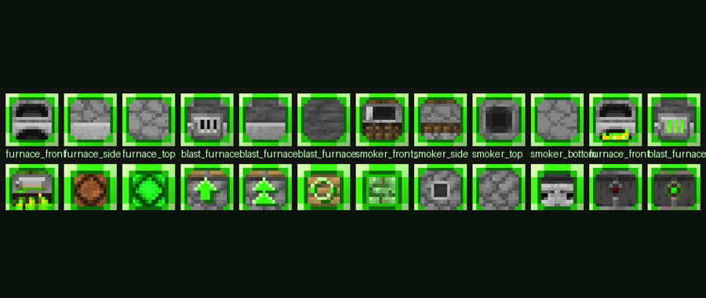

# Neon Redstone

**A neon-green texture pack for redstoners: everything redstone-relevant gets an outline you can read at a glance.**

---

All textures are computed from the vanilla originals by script - nothing is hand-pixelled. Buttons and plates turn completely neon green, chests, furnaces and shulker boxes get outlines, pistons and dispensers get direction arrows.

## What it does

- Buttons (all 14 kinds) and pressure plates (light = 1 dot, heavy = 2 dots) in neon green
- Chests with a thin green border, **trapped chests with a thick one** - instantly distinguishable
- Shulker boxes (all 17 colours), furnaces, blast furnaces and smokers outlined
- Tripwire and string as a bold continuous line, tripwire hooks in green
- Redstone lamps: green outline off, glowing green on; levers with green handle and base
- Pistons and sticky pistons with an arrow towards the piston head, dispensers and droppers with a framed nozzle and arrows

## Download

Download **`Neon-Redstone-v1.0.1.mcaddon`** from the [releases page](../../releases) (or straight from this repository) and open it - Minecraft imports the packs.

1. Create or edit a world and open **Add-Ons**.
2. Activate the **Behavior Pack** and the **Resource Pack** of this add-on.
3. Requires Minecraft Bedrock **1.21.110 or newer**.

If items are missing in your world, check the world's *Experiments* page and enable *Beta APIs* and *Holiday Creator Features* as a fallback.

New to this? Follow **[SETUP-HELP.md](SETUP-HELP.md)** - it walks you through installing and starting it.

## What is in the package

The `.mcaddon` contains the **resource pack** plus a tiny behavior pack that only adds the Dev Book easter egg (a texture pack alone cannot add items).

## Dev Book

Every pack of mine carries a small easter egg: craft the **Dev Book** with **9 logs** (any wood type, 3x3 in a crafting table) and right-click it. It opens like a book: page 1 the credits, page 2 what this mod is, page 3 the GitHub links (Minecraft cannot open links, so they are shown as text). It also sits in the creative inventory under *Equipment*.

## Notes

- The textures are derived from Minecraft's vanilla textures, which belong to Mojang; this pack contains only recoloured/derived versions. If Mojang objects, it will be taken down.
- Not an official Minecraft product. Not approved by or associated with Mojang or Microsoft.

---

Made by **dev:#2444** - [github.com/hash2444](https://github.com/hash2444) - [neon-redstone](https://github.com/hash2444/neon-redstone)
